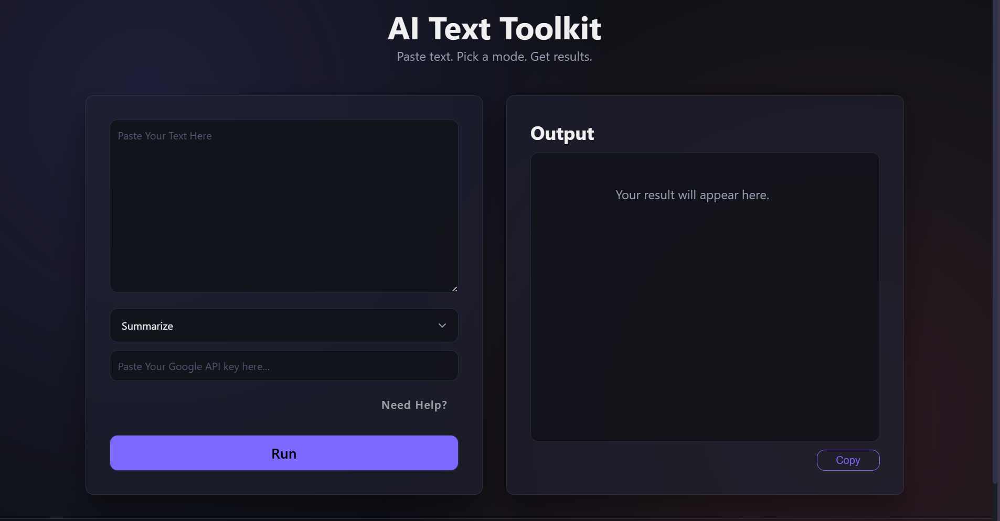
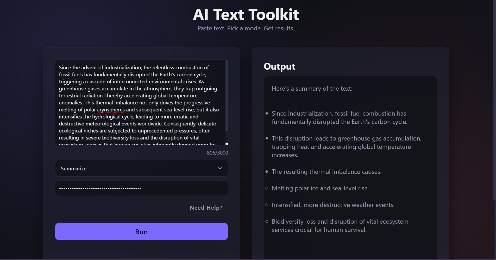

# AI Text Toolkit ✦

A clean, minimal AI-powered text tool built with vanilla HTML, CSS, and JavaScript.
Paste any text, choose a mode, and let Gemini do the work.

## 🚀 Live Demo
[ai-text-toolkit.netlify.app](https://ai-text-toolkit.netlify.app)

## 📸 Screenshot
### Before Interaction:


### After Interaction:


## ✨ Features

- `Summarize` `Grammar Fix` `Formal Rewrite` `Casual Rewrite` `Translate` `Key Points`
- Live character counter
- Copy output with one click
- Loading state and error handling
- Clean dark UI

## 🛠 Tech Stack
- HTML5
- CSS3
- Vanilla JavaScript
- Gemini API

## 💻 Run Locally
1. Clone the repo 
git clone [ai-text-toolkit](https://github.com/Saqib216/ai-text-toolkit)
2. Open index.html in your browser
3. Paste your Gemini API key in the API key field
4. Start using the app

## 📁 Folder Structure
```
ai-text-toolkit/
├── index.html
├── README.md
├── assets/
│   ├── before.png
│   └── after.png
├── css/
│   └── style.css
└── js/
    └── script.js

```

## 👤 Author

- **Muhammad Saqib Hussnain**
- GitHub: [@Saqib216](https://github.com/Saqib216)
- Portfolio: [saqib-portfo.netlify.app](https://saqib-portfo.netlify.app)

---